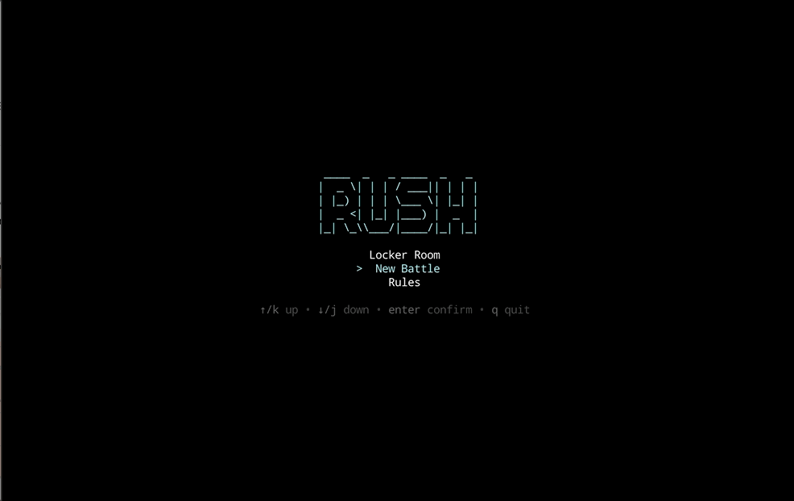

# rush

Rush is a five-player lane battle game that blends elements from risk and battle arena games. 
Built in Go, the game emphasises deep, meaningful strategic decisions through [coach personas](internal/ui/rules.md), tactical playbooks, and dynamic lane-based combat.

## Quick Demo



## Prerequisites

- [Go](https://go.dev/doc/install) (latest stable version)
- [Task](https://taskfile.dev/installation/) (task runner)
- [golangci-lint](https://golangci-lint.run/usage/install/) (for linting)
- [sqlc](https://sqlc.dev/usage/install/) (for database code generation)

## Getting Started

### Installation

1. Clone the repository:
   ```bash
   git clone <repository-url>
   cd rush
   ```

2. Tidy dependencies:
   ```bash
   task format
   ```

### Running the Application

To run the game:
```bash
task dev
```

### Development

We use `Taskfile.yml` to manage project tasks. To see all available commands, run:
```bash
task --list
```

Key tasks include:
- `task test`: Run unit tests.
- `task lint`: Run linters.
- `task format`: Format code and tidy modules.
- `task db-reset`: Reset the database to a clean state.
- `task cover`: Generate and show test coverage.

## Project Structure

- `cmd/`: Application entrypoint.
- `internal/`: Core application logic.
- `docs/`: Documentation.
